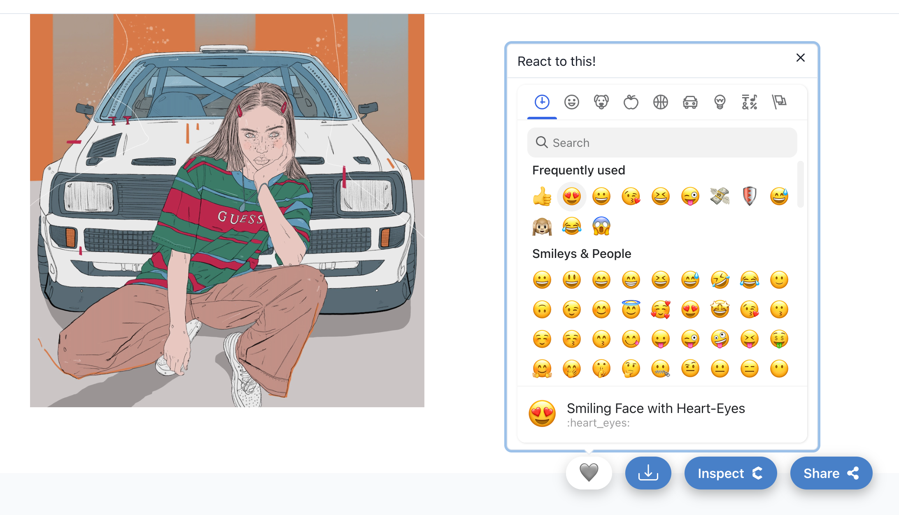

It is now possible to "emote" or "react" on any NFT.

Under the hood, unicodes are applied to NFT IDs in a separate record.

Reactions are switches, meaning sending 👍 when you already sent a 👍 will
remove it.

Currently, all reactions apply equally and are rendered by all implementations,
but in the future there are plans to add acceptance conditions to collections
that would limit emotes from people without a certain NFT, cap the emote amount
to accommodate a FCFS list, limit the types of emotes an NFT can receive, and
more.

During a transfer, all reactions travel with an NFT. The reactions are not NFTs
themselves, just flair added to an existing data record - the NFT.

Emotes are a key part of [conditional rendering](/explanations/nft_legos/conditional).

The emote functionality is fully implemented on
[Emotes.app](https://emotes.app), as well as on
[Singular.app](https://singular.app).

Emotes are a built-in part of every NFT, even ERC-721 (NFT 1.0), and will be
applicable to any past, present, of future NFT.

Documentation on how to read these values or even allow your users to write them
can be found on the Emotes mini-app.
