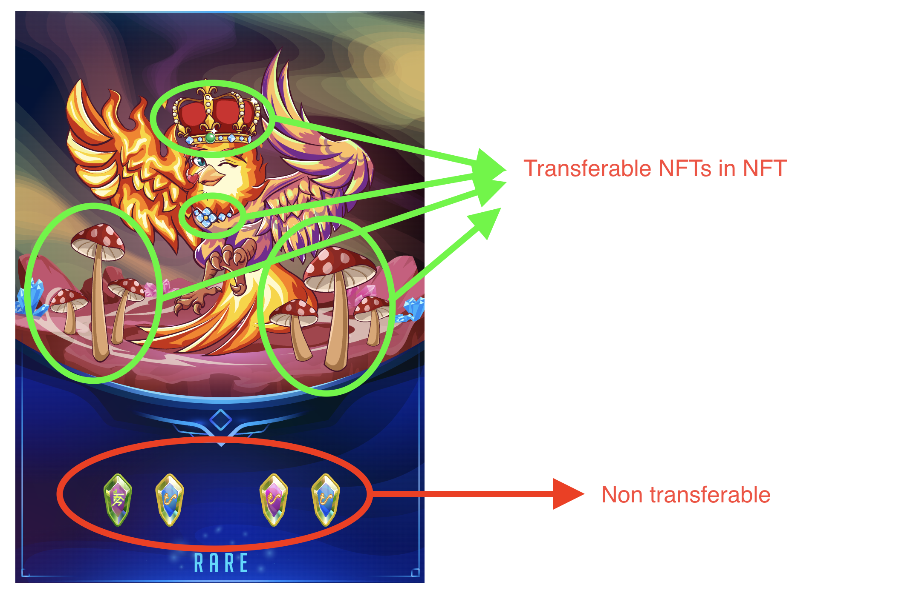

Non-transferable NFTs, popularized by Vitalik Buterin as
[soulbound](https://vitalik.ca/general/2022/01/26/soulbound.html), are NFTs that
are currently useful for reputation or attendance tracking: they get added to
addresses but are non-transferable, so they cannot be sold. Therefore, they
permanently assign some modifier to a given address.

In RMRK this is an especially interesting concept as NFTs can be
non-transferable inside another **transferable** NFT, dubbed **Soulbound 2.0**.

Thus, an NFT like a [Kanaria](https://url.rmrk.app/demobird) can have
non-transferable gems inside it that give it long lasting benefits and bonuses,
but these gems cannot be removed. Alongside those locked NFTs, there can be
other, tradable NFTs as well.

This can be further utilized when dealing with [in-game avatars and skill
systems](/usecases/charprog). A non-transferable skill can be learned and
"installed" into an avatar's non-transferable brain NFT, but cannot be moved out
of the avatar's brain NFT.

## Examples

As mentioned in the concept of [equippables](/explanations/nft_legos/equippable), a very good
example of using non-transferable NFTs is when using them as reputation
indicators, but not on accounts as documented in the aforementioned [soulbound
post](https://vitalik.ca/general/2022/01/26/soulbound.html), but inside other
transferable or non-transferable NFTs.

- [Zeitgeist](https://zeitgeist.pm), a prediction market chain [gives each chain
  user an avatar](https://app.zeitgeist.pm/), and gives them reputational (non
  transferable) tokens to equip, based on their performance in their prediction
  markets or their activity on chain.

- [Governance Rewards in Kusama](https://www.youtube.com/watch?v=lpT7hubqzFQ)
  rewards people with trophies for every on-chain referendum they vote in, which
  they can equip onto their “reputational” shelf. This not only visually
  indicates your on-chain activity in the world’s biggest DAOs (Kusama and
  Polkadot) but also serves really well for other apps, e.g. you read that
  information cross-chain from a Defi hub like Acala, and maybe your reputation
  is now enough collateral to get an undercollateralized loan.

- [Phala World](https://phala.world) tracks a user’s web3 activity, and [turns
  it](https://phala.world/claim/) into non-transferable reputation tokens inside
  of Phala World game avatars which can only be leveled up this way. So instead
  of leveling up by playing the game, you level up by being a good web3 citizen,
  which turns into non-transferable skills and experience for your avatar.

- [Kabocha](https://rmrk.link/kabocha) Seeds are central to the governance of
  Kabocha, representing evolving roles, rights and reputation in the network and
  future Publiks. Seeds are unique, non-transferable assets that grow based on
  continuing contributions to the project. They will define how you build
  identity, your voting power and access within future Publik domains.

- [Skybreach](https://skybreach.app) uses non-transferable NFTs as NFT brains
  for NFT avatars, and NFT skills inside of those brains which can be equipped
  into slots, as well as NFT personalities, NFT crafting recipes, NFT
  pathfinding algorithms and more. For example, a character at level 2 might
  have 2 skill slots in their NFT brain, but 5 skills. So now they have to
  choose which skills to make active by equipping 2 of 5. They can level up the
  character to get a new asset on this NFT brain which has 3 slots, so at level
  3 they can equip 3 of 5 skills, and so on. This is how [Skybreach
  Chunkies](https://rmrk.gitbook.io/kanaria-skybreach/fundamentals/skybreach-avatars/chunkies)
  work and is further explored in [Character Progression
  systems](/usecases/charprog).
  
- [NPC.app](https://npc.app) is an abstraction of Skybreach technology (see
  above) to be applicable to RPGs and agent simulations in general, also using
  NFT brains to equip personality traits, skills, and more.

All of the above projects are also part of the [global item
economy](/explanations/usecases/econ) made possible only with RMRK.

Non-transferable NFTs are specified as a standard in
[ERC-6454](https://eips.ethereum.org/EIPS/eip-6454). The Non-transferable NFT
implementation by RMRK is documented in the [reference](/reference/intro) and
exemplified in the [guides](/guides/intro).

The easiest way to launch Nestable NFTs is to use one of the [mini
apps](/explanations/minis) or directly on [Singular](https://singular.app).
