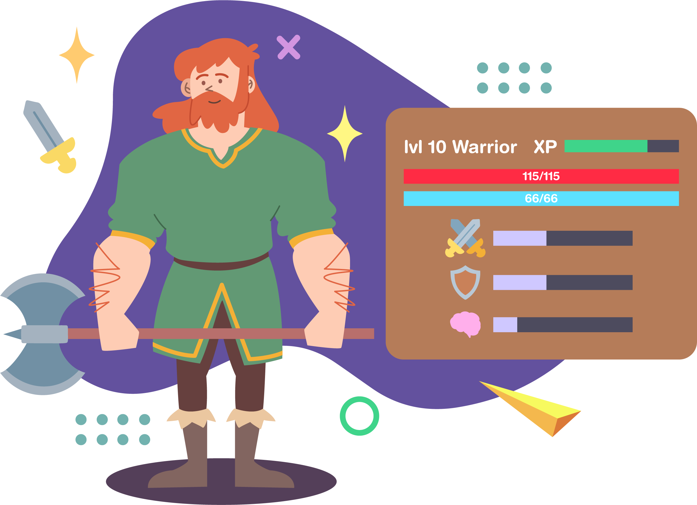
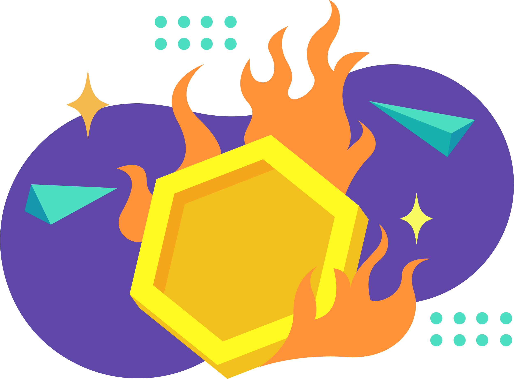

In current metaverse projects, most experience is stored on a centralized
server: your level progress, skills, even resources gathered. In most cases,
even projects advertising equippables use just a centralized database to pretend
it's NFT equipment.

If this server goes down - as it inevitably will due to expensive centralized
infrastructure and vampire attacks from other projects - so does the experience.

RMRK NFTs enable true Ownership of Experience in that you log out of a game-like
experience with a slightly more valuable NFT every time.

Your character can grow and level up over time by collecting [non-transferable
soulbound 2.0](/explanations/nft_legos/nontransferable) "experience NFTs", it can keep its
[accessories](/explanations/nft_legos/equippable) and assets _inside_ of itself, and it can
be given [new visual of functional assets](/explanations/nft_legos/multiasset) over time as
it evolves.

This allows an NFT to grow, evolve, and keep growing in value in a decentralized
way, to the point of being recognizable as valuable and evolved by any future
game or metaverse project.

With RMRK, NFTs become generational wealth through
[Evolution](#evolution) or [Character Progression
Systems](/explanations/usecases/charprog).

## Evolution

With last-gen NFT technology, replacing an NFT to evolve or change it requires
either centralized metadata, or a burn-and-mint mechanic.

With RMRK's [Multi-Asset NFTs](/explanations/nft_legos/multiasset), this is easier.

If an asset is added to an NFT with an extra argument provided targeting an
existing asset by asset ID, that targeted asset will be **replaced**.

This makes for good _evolution_ mechanics where an NFT can grow or change over
time. E.g. a tree that grows from seed, to sapling, to young tree, to mature
tree. Additionally, assuming the tree NFT needed to be watered with 💦 emoji
every week or else it would die, it is possible that yet another asset could
represent a tree's death stage.

Each stage of its growth is a new asset, replacing the previous one.

This is also useful in games. Imagine Pikachu evolving into Raichu by just
having a asset replaced in a fully decentralized way, no single point of failure
in between.

## Provable Digital Scarcity

Most NFT projects today are only mock-scarce. Sure, there is a limited supply of
them, but the utility of these NFTs (if any) is uncapped.

As an example, you can log into 500 different instances of Sandbox with the same
wallet using the same NFT. You can equip the same hat onto 500 different in-game
avatars at the same time, because its visual representation is just a
client-side thing. The platforms and projects are not at all Sybil-resistant,
and the NFTs not scarce.

With RMRK's modular NFTs, and to use games as an example again for simplicity, a
piece of metaverse land IS an NFT. And for an avatar to be IN that land, it has
to be IN that land - literally sent into the other NFT. By definition, if it is
in one land, it cannot be in another. If a hat is equipped on one avatar (by
being sent into it and then equipped), it cannot be on another.

With RMRK's standards, true and provable digital scarcity as originally promised
by NFT technology comes default.
